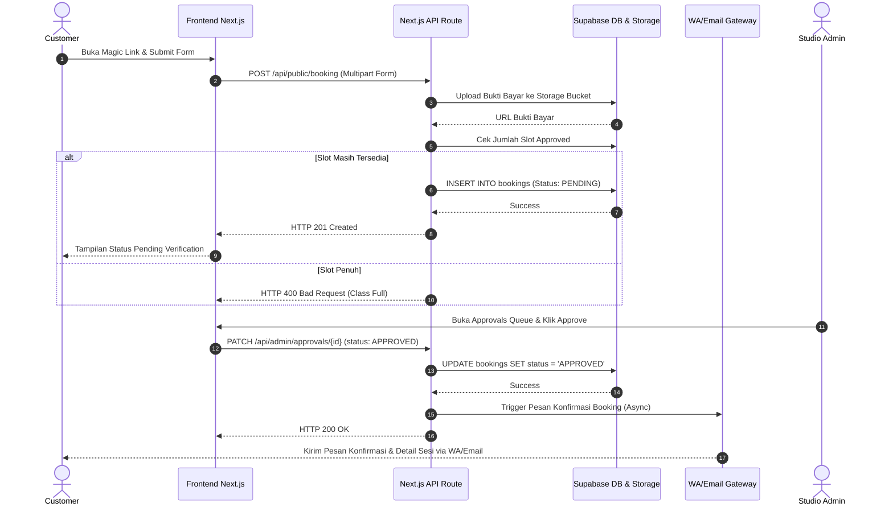

# Backend Implementation Plan - Bookelas MVP

## 1. Overview & Architecture
Backend Bookelas memanfaatkan **Supabase (PostgreSQL + Auth + Storage)** dan **Next.js App Router API Routes** untuk menangani pendaftaran, manajemen kelas, verifikasi transfer, serta automasi notifikasi WhatsApp/Email.

### Tech Stack Backend:
- **Database & Storage**: Supabase (PostgreSQL)
- **API Engine**: Next.js Route Handlers (`/app/api/...`)
- **Authentication**: Supabase Auth (khusus Admin Studio)
- **Scheduled Jobs**: Vercel Cron / Supabase `pg_cron`
- **Notification Provider**: WhatsApp API Gateway (e.g., Fonnte/Wablas/Twilio) + Resend (Email)

---

## 2. Database Schema (PostgreSQL DDL)

```sql
-- 1. Tabel Studio (Single Tenant Configuration)
CREATE TABLE studios (
    id UUID PRIMARY KEY DEFAULT gen_random_uuid(),
    name TEXT NOT NULL,
    wa_number TEXT NOT NULL,
    bank_info TEXT NOT NULL,
    created_at TIMESTAMPTZ DEFAULT NOW()
);

-- 2. Tabel Master Kelas
CREATE TABLE classes (
    id UUID PRIMARY KEY DEFAULT gen_random_uuid(),
    studio_id UUID REFERENCES studios(id) ON DELETE CASCADE,
    title TEXT NOT NULL,
    description TEXT,
    capacity INT NOT NULL DEFAULT 10,
    price NUMERIC(12, 2) NOT NULL,
    created_at TIMESTAMPTZ DEFAULT NOW()
);

-- 3. Tabel Sesi / Jadwal Kelas
CREATE TABLE class_sessions (
    id UUID PRIMARY KEY DEFAULT gen_random_uuid(),
    class_id UUID REFERENCES classes(id) ON DELETE CASCADE,
    start_time TIMESTAMPTZ NOT NULL,
    end_time TIMESTAMPTZ NOT NULL,
    magic_token UUID UNIQUE DEFAULT gen_random_uuid(),
    status TEXT CHECK (status IN ('SCHEDULED', 'COMPLETED', 'CANCELLED')) DEFAULT 'SCHEDULED',
    created_at TIMESTAMPTZ DEFAULT NOW()
);

-- 4. Tabel Bookings
CREATE TABLE bookings (
    id UUID PRIMARY KEY DEFAULT gen_random_uuid(),
    session_id UUID REFERENCES class_sessions(id) ON DELETE CASCADE,
    customer_name TEXT NOT NULL,
    customer_wa TEXT NOT NULL,
    customer_email TEXT NOT NULL,
    payment_proof_url TEXT NOT NULL,
    status TEXT CHECK (status IN ('PENDING', 'APPROVED', 'REJECTED')) DEFAULT 'PENDING',
    created_at TIMESTAMPTZ DEFAULT NOW()
);

-- Indexes untuk optimasi query
CREATE INDEX idx_sessions_magic_token ON class_sessions(magic_token);
CREATE INDEX idx_bookings_session_status ON bookings(session_id, status);
```

---

## 3. Sequence Diagram Workflow (Mermaid)



---

## 4. API Endpoints Specification

### Public Endpoints:
- `GET /api/public/session/[magic_token]`
  - Mengambil detail kelas, jadwal, sisa kuota (`capacity - count(approved)`), dan info rekening bank.
- `POST /api/public/booking`
  - Body: `MultipartFormData` (session_id, customer_name, customer_wa, customer_email, file_bukti_bayar).

### Protected Admin Endpoints:
- `GET /api/admin/calendar?start_date=...&end_date=...`
  - Memuat seluruh sesi kelas beserta data statistik pendaftar.
- `GET /api/admin/approvals?status=PENDING`
  - Memuat daftar antrean pendaftaran yang belum diverifikasi.
- `PATCH /api/admin/approvals/[booking_id]`
  - Body: `{ "status": "APPROVED" | "REJECTED" }`. Mentrigger notifikasi jika disetujui.
- `POST /api/admin/sessions`
  - Menambahkan sesi kelas baru dan menghasilkan `magic_token` unik.

---

## 5. Cron Job & Automasi Notifikasi
- **Class Reminder Job**: Dijalankan setiap 1 jam via Vercel Cron.
- Query mencari transaksi `APPROVED` pada `class_sessions` yang dimulai dalam **24 jam ke depan**.
- Mengirim pesan pengingat otomatis ke WhatsApp/Email pelanggan.

---

## 6. Rencana Tahapan Eksekusi Backend
1. **Tahap 1**: Setup Proyek Supabase, Migrasi Schema SQL DDL & Config Bucket Storage `payment-proofs`.
2. **Tahap 2**: Buat API Endpoint Public (`GET /session/[magic_token]` & `POST /booking`).
3. **Tahap 3**: Buat API Endpoint Admin (`GET /approvals`, `PATCH /approvals/[id]`, CRUD Sessions).
4. **Tahap 4**: Integrasi API Provider WhatsApp & Resend Email Service.
5. **Tahap 5**: Setup Cron Job untuk Notifikasi Reminder Kelas.
