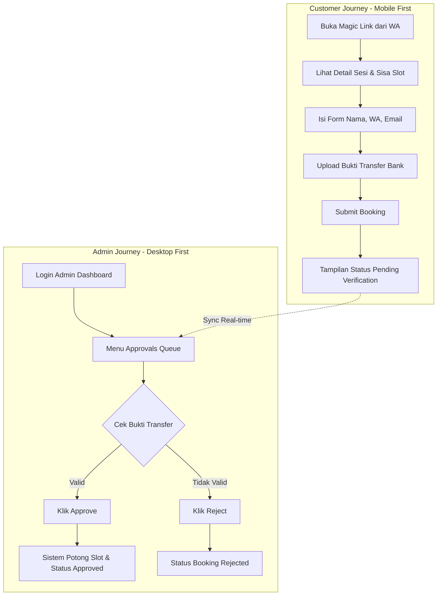

# Frontend Implementation Plan - Bookelas MVP

## 1. Overview & Tech Stack
Bookelas adalah sistem manajemen booking studio fitness (Yoga/Pilates) berbasis WhatsApp. Frontend dikembangkan dengan fokus pada **Mobile-First** untuk sisi pelanggan (*zero friction*, tanpa login) dan **Desktop-First High Density Data** untuk sisi Admin Studio.

### Tech Stack Frontend:
- **Framework**: Next.js 16.3.0 (App Router, Turbopack) + React 19.2.8
- **Language**: TypeScript 5.6.3
- **Styling**: Tailwind CSS 3.4.15 + PostCSS
- **UI Components**: Tailwind local primitives (no shadcn/ui dependency currently)
- **Icons**: `lucide-react`
- **State & Data Fetching**: TanStack Query (React Query) v5
- **Form Validation**: React Hook Form + Zod
- **Notifications**: Sonner
- **Fonts**: `next/font/google` — Lora (display) + Manrope (body)
- **Package Manager**: npm
- **Runtime Verification**: Node.js `--experimental-strip-types` self-checks (no test framework)

---

## 2. Struktur Navigasi & Directory Routing

```text
app/
├── (admin)/                    # Layout Shell khusus Admin (Protected Route)
│   ├── layout.tsx              # Sidebar + Topbar Header Navigation
│   ├── dashboard/              # Metrics Overview & Quick Actions
│   │   └── page.tsx
│   ├── calendar/               # Interactive Class Calendar View
│   │   └── page.tsx
│   ├── approvals/              # Verification Queue Bukti Transfer
│   │   └── page.tsx
│   └── classes/                # Master Data Kelas & Sesi
│       └── page.tsx
├── (customer)/                 # Standalone Public Layout (No Navbars)
│   └── b/[magic_token]/        # Dynamic Magic Link Booking Page
│       └── page.tsx
├── layout.tsx                  # Root Layout & Font Providers
└── page.tsx                    # Redirect to Login / Dashboard
```

---

## 3. Flowchart Journey Frontend (Mermaid)



---

## 4. UI/UX Specifications & ASCII Wireframes

### A. Customer Booking Page (`/b/[magic_token]`)
* **UX Strategy**: Minimalis, pengisian form super cepat, langsung memperlihatkan info rekening bank.

```text
+---------------------------------------------------+
|                     BOOKELAS                      |
|             Zenith Pilates Studio                 |
+---------------------------------------------------+
| [ Banner / Cover Kelas ]                          |
|                                                   |
| Mat Pilates - Reformer Intro                      |
| 📅 Sabtu, 15 Ags 2026 | ⏱️ 09:00 - 10:00 WITA      |
| 📍 Studio A | 🏷️ Rp 150.000                        |
| 👥 Sisa Kursi: 3 / 10                             |
+---------------------------------------------------+
| FORM PENDAFTARAN                                  |
|                                                   |
| Nama Lengkap *                                    |
| [===============================================] |
|                                                   |
| Nomor WhatsApp *                                  |
| [===============================================] |
|                                                   |
| Email *                                           |
| [===============================================] |
+---------------------------------------------------+
| INSTRUKSI PEMBAYARAN                              |
| Bank BCA: 123-456-7890 a/n Zenith Studio          |
|                                                   |
| Upload Bukti Transfer *                           |
| +-----------------------------------------------+ |
| | [ 📁 Pilih File / Drop Gambar Bukti Transfer ]| |
| +-----------------------------------------------+ |
|                                                   |
| [         KIRIM KONFIRMASI BOOKING              ] |
+---------------------------------------------------+
```

### B. Admin Approvals Queue (`/approvals`)
* **UX Strategy**: List dengan densitas data tinggi, tombol verifikasi cepat (*Approval Modal Preview*).

```text
+-----------------------------------------------------------------------------------+
| BOOKELAS ADMIN | 📅 Calendar  | 📥 Approvals (3) | 🧘 Classes  | ⚙️ Settings     |
+-----------------------------------------------------------------------------------+
| PENDING APPROVALS QUEUE                                                            |
|                                                                                   |
| [Search Nama/WA...]  [Filter Kelas: All  v]                                       |
+-----------------------------------------------------------------------------------+
| WAKTU       | CUSTOMER     | KELAS            | BUKTI BAYAR   | AKSI              |
+-------------+--------------+------------------+---------------+-------------------+
| 10 Menit lalu| Sarah A.    | Reformer Intro   | [📄 Lihat]    | [✅ Approve]      |
|             | 08123456789  | Sab, 09:00 WITA  | (Rp 150.000)  | [❌ Reject ]      |
+-------------+--------------+------------------+---------------+-------------------+
| 25 Menit lalu| Budi Santoso | Power Yoga       | [📄 Lihat]    | [✅ Approve]      |
|             | 08198765432  | Min, 16:00 WITA  | (Rp 120.000)  | [❌ Reject ]      |
+-----------------------------------------------------------------------------------+
```

### C. Admin Calendar View (`/calendar`)
* **UX Strategy**: Menampilkan jadwal per minggu dengan tombol aksi instan untuk *Copy Magic Link*.

```text
+-----------------------------------------------------------------------------------+
| BOOKELAS ADMIN | 📅 Calendar  | 📥 Approvals | 🧘 Classes  | ⚙️ Settings          |
+-----------------------------------------------------------------------------------+
| JADWAL KELAS MINGGU INI                         [ + Tambah Sesi Kelas Baru ]      |
| <  Minggu 10 - 16 Agustus 2026  >                                                |
+-----------------------------------------------------------------------------------+
| SENIN (10)   | SELASA (11)  | RABU (12)    | KAMIS (13)   | JUMAT (14)  | SABTU (15)|
+--------------+--------------+--------------+--------------+-------------+-----------+
| 08:00        |              | 08:00        |              |             | 09:00     |
| Gentle Yoga  |              | Morning Flow |              |             | Reformer  |
| (8/10)       |              | (10/10 FULL) |              |             | (7/10)    |
| [🔗 Copy Link]|              | [🔗 Copy Link]|              |             |[🔗 Link]  |
+--------------+--------------+--------------+--------------+-------------+-----------+
```

---

## 5. Rencana Tahapan Eksekusi Frontend
1. **Tahap 1**: Setup Proyek Next.js, Install `shadcn/ui`, Tailwind & Theme Provider.
2. **Tahap 2**: Buat Public Magic Link Booking Page (`/b/[magic_token]`) lengkap dengan validasi Zod & upload preview.
3. **Tahap 3**: Buat Admin Shell Layout (Sidebar, Navigation Topbar, User Menu).
4. **Tahap 4**: Implementasi Halaman Approvals Queue & Modal Verification Image Preview.
5. **Tahap 5**: Implementasi Calendar Grid View & Quick Action "Copy Magic Link".
